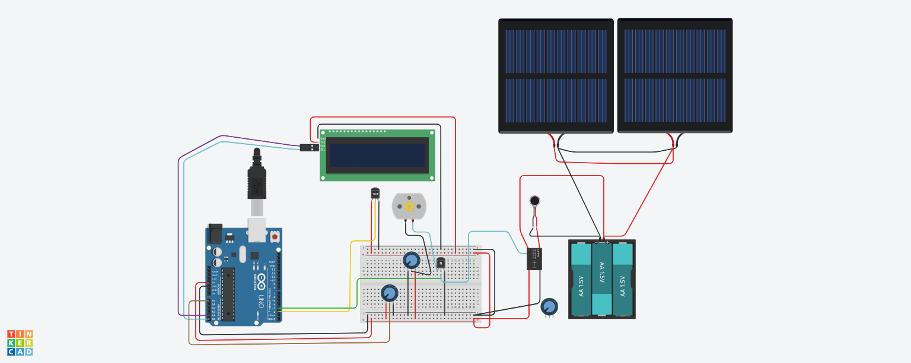

# HydroGuard
## University Project
#### 2007111 - Plaban Das
#### 2007101 - Choyan Mitra Barua Bijoy
#### .
## The world's first water lumbar traction system with weather control 

  

# Project Overview With Video 
Video Overview Link :: [Checkout For All Details !!](https://www.youtube.com/watch?v=lkTgVo6YzuI)

### Disease Overview Fig: 1

### Disease Stages Fig: 2

### Our Setup Fig: 3

### Our Setup Fig: 4

### Frontal View Of Healing Fig: 5

### Sided View Of Healing Fig: 6

### Disc Bulging Healing Fig: 7

### Disc Herniation Healing Fig: 8

# Circuit Overview
-Choyan

-Plaban

